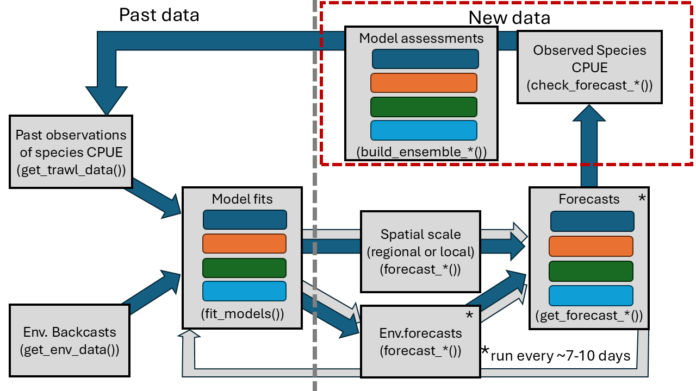
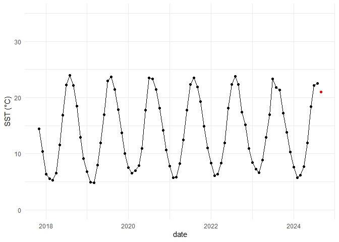

<!-- README.md is generated from README.Rmd. Please edit that file -->

------------------------------------------------------------------------

## Overview

This repository houses the analytical pipeline to support the project,
*Defining foraging hotspots of finfish and sharks in the New York Bight:
Linking trophic dynamics with spatiotemporal trends in species
distributions*.

### Purpose

This pipeline is used to summarise data of trawl species data, pull
environmental forecasts and backcasts of regional environmental
variables, fit species and community models of the biological community,
and forecast species biomasses/abundance to predict future sampling. The
general structure of the pipeline is shown below.

<div class="figure" style="text-align: center">


<p class="caption">

General schematic of the analytical pipeline to predict species
biomasses.
</p>

</div>

### Repository structure

The repository is structured to keep the workflow organized. To do so,
it uses the [‘here’ package](https://here.r-lib.org/) to navigate the
file structure across users. The package can be installed from CRAN
using `install.pacakges('here')`.

The main repository structure contains the folders:

- code: This contains all the scripts to load and clean the biological
  and environmental data.

Within this folder the `init.R` script contains the important
standardized, study-level variables that should be used for initial
project setup and data downloads. This script loads all required
packages, internal functions and options, and repository checks to
correctly setup the repository across users.

- data: This folder holds derived data output from functions. The raw
  trawl data is stored on a local Access database named,
  `Nearshore Survey.accdb`. This file must be placed in a local folder
  in the project root directory called, `ignore`. The `ignore` folder
  should be added to the `.gitignore` file to avoid corrupting the
  database during Git procedures. The `init.R` file contains a procedure
  to check that the file structure is correct.

- docs: This folder houses project documents and output reports to
  summarise models and forecasts

- ignore: This is a hidden local folder that houses the Access database.
  This should be included in the local project `.gitignore` so must be
  created by each user. See above for initiation checks in the `init.R`
  script.

### Database access

Once the database is correctly stored locally, access to the database is
managed by the [RODBC
package](https://cran.r-project.org/web/packages/RODBC/index.html). This
can be downloaded from CRAN using `install.packages("RODBC")`.

The connection to the database is set using

``` r
conn <- odbcConnectAccess2007(here("ignore/Nearshore Survey.accdb"))
```

and all the available database tables with

``` r
sqlTables(conn)
```

    #>           TABLE_NAME   TABLE_TYPE
    #> 1       CODE_SPECIES      SYNONYM
    #> 2  MSysAccessStorage SYSTEM TABLE
    #> 3      MSysAccessXML SYSTEM TABLE
    #> 4           MSysACEs SYSTEM TABLE
    #> 5 MSysComplexColumns SYSTEM TABLE

### Environmental variables from the Copernicus Marine Service

Hindcasts and forecasts of environmental variables such as Sea Surface
Temperature (SST) and chlorophyll-a (chla) are sourced from [Copernicus
Marine Service](https://marine.copernicus.eu/). Updated products are
accessed through the Copernicus API. To do so, you must [register a free
Copernicus account](https://data.marine.copernicus.eu/register).

Accessing the Copernicus API is operated with the [`copernicusR`
package](https://github.com/HansTtito/copernicusR). To install the
package:

``` r
# Install if you don't have remotes
if (!requireNamespace("remotes", quietly = TRUE)) {
  install.packages("remotes")
}

# Install copernicusR
remotes::install_github("HansTtito/copernicusR")

# Load the package
library(copernicusR)
```

Follow the instructions on the [`copernicusR`
page](https://github.com/HansTtito/copernicusR) to set up the
credentials of your Copernicus account. It is recommended to follow the
“Alternative Setup: Method 3” instructions to securely set environmental
variables for your account username and password.

#### Initial download

The Copernicus systems provide a number of different environmental data
products that vary in the spatial and temporal extents. Initial data
downloads of hindcast data were completed for the study area in the
following coordinates:

``` r
NYSbbox = c(-74.262999, -71.389711, 39.803091, 41.431287)
```

This should be used for all data downloads of regional environmental
data.

Sea surface temperature data is provided in two different products, one
prior to 2022-06-01 (Global Ocean Physics Reanalysis:
GLOBAL_MULTIYEAR_PHY_001_030), and the current forecast out 1-week from
current (Global Ocean Physics Analysis and Forecast:
GLOBAL_ANALYSISFORECAST_PHY_001_024). These were initially combined by
downloading and summarising the data for the study area:

``` r
# download the re-analysis data product for before 2022-06-01
# this is monthly mean sst
sstHindPath = copernicus_download(
  dataset_id = "cmems_mod_glo_phy_my_0.083deg_P1M-m",
  dataset_version = "202311",
  variables = "thetao",
  start_date = bioHindStart,
  end_date = bioStart,
  bbox = NYSbbox,
  depth = c(0.49402499198913574,1), # 0.5m to 1m depth
  output_file = here("data/sstHind.nc")
  )
# turn this into a raster object
sstHindRast = terra::rast(sstHindPath)
# set the starting date for each observation
sstHindDate = as.Date(as.POSIXct(sstHind@ptr[["time"]], format = "%Y-%m-%d %H:%M:%S"), format = "%Y-%m")
# extract the area mean temperature. na.rm must be TRUE because land area in the study box
sstHindMean = terra::global(sstHind, 'mean', na.rm = TRUE)
sstHindDf = data.frame(date = sstHindDate,
                       sst = sstHindMean)
# download the data product for 
sstPath = copernicus_download(
  dataset_id = "cmems_mod_glo_phy-thetao_anfc_0.083deg_P1M-m",
  dataset_version = "202406",
  variables = 'thetao',
  start_date = bioStart,
  end_date = bioEnd,
  bbox = NYSbbox,
  depth = c(0.49402499198913574,1),# 0.5m to 1m depth
  output_file = here("data/sstFore1.nc")
  )
# set this as a raster object
sstRast = terra::rast(sstPath)
# set the starting date for each observation
sstDate = as.Date(as.POSIXct(sstRast@ptr[["time"]], format = "%Y-%m-%d %H:%M:%S"), format = "%Y-%m")
# extract the area mean temperature. na.rm must be TRUE because land area in the study box
sstMean = terra::global(sstRast, 'mean', na.rm = TRUE)
sstDf = data.frame(date = sstDate,
                   sst = sstMean)

sstDf = bind_rows(sstHindDf, sstDf) %>%
  data.frame %>% 
  dplyr::summarise(sst = mean(mean), .by = 'date')

saveRDS(sstDf, here('data/sst.rds'))
```

This data currently covers 1-month past the final trawl data of
2024-08-14 (i.e., 2024-09-14). For the purposes of this initial
exercise, we would treat this next month for forecasting purposes.

``` r
sst = readRDS(here('data/sst.rds')) %>% 
  dplyr::mutate(future = ifelse(as.Date(date) <= as.Date("2024-08-14"), FALSE, TRUE))

sst %>% 
  ggplot()+
  geom_point(aes(x = date, y = sst, color = future))+
  geom_line(aes(x = date, y = sst, color = future))+
  scale_color_manual(values = c('black','red'))+
  scale_y_continuous(name = expression(paste("SST (","\u00B0","C)")),
                     limits = c(0,35))+
  theme(legend.position = "none")
```

<!-- -->
